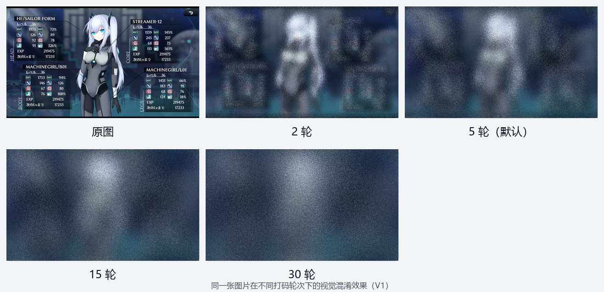
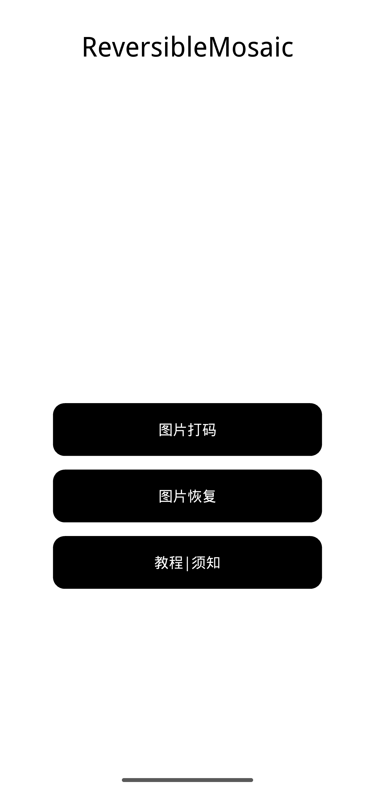
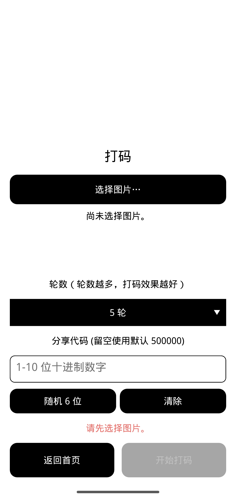
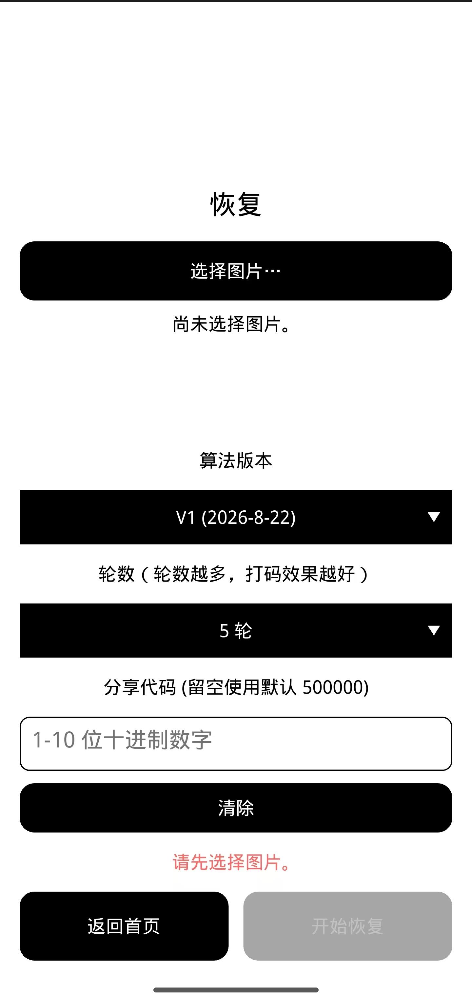
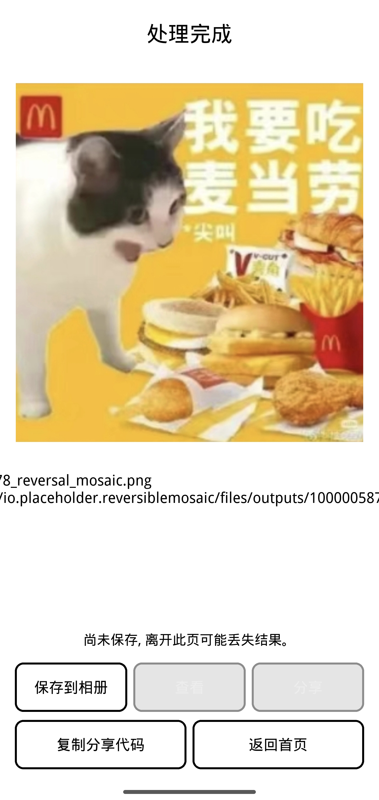

# ReversibleMosaic

**ReversibleMosaic** 是一款 Android 本地图片视觉混淆工具：选择一张图片，在手机上完成打码、保存和恢复。图片不需要上传到服务器，适合在分享前暂时遮挡照片中的文字、人物细节或其他不希望直接被看清的内容。

> **重要说明**：ReversibleMosaic 提供的是“可逆视觉混淆”，不是密码学加密。它不能保证绝对保密、身份认证或防止他人尝试猜测分享代码。

## APP 使用效果

下面使用同一张原图展示不同打码轮次的效果。轮次越高，通常越难直接看清原图内容，但处理时间也可能相应增加。

- **原图**：未处理的图片。
- **2 轮**：适合快速确认流程，局部细节会被打乱，主体轮廓可能仍然可辨认。
- **5 轮（默认）**：文字和细节通常已经难以直接辨认。
- **15 轮**：更强的视觉混淆，适合对隐私要求更高的场景。
- **30 轮**：V1 提供的最高轮次。

示意图只用于说明视觉变化，不代表任何密码学安全等级，也不表示所有图片在每个轮次下都能达到相同的遮挡效果。

## 快速开始

### 1. 从首页选择操作

打开 **ReversibleMosaic** 后，会看到首页：

- 选择 **图片打码**，生成视觉混淆后的图片；
- 选择 **图片恢复**，恢复之前处理过的图片；
- 选择 **教程 | 须知**，查看应用内的使用说明和注意事项。

### 2. 生成混淆图片

在首页点击 **图片打码**，然后按以下步骤操作：

1. 点击 **选择图片...**，选择需要处理的图片；
2. 选择打码轮次，默认使用 **5 轮**；
3. 分享代码会自动填入，通常不需要修改（使用500000作为默认值）；如需使用其他代码，可以自行修改，或点击 **随机 6 位** 生成新代码；恢复图片时，只有在打码时改过代码，才需要把自动填入的代码改为与打码时相同的代码。
4. 点击 **开始打码**；
5. 处理完成后，预览结果并保存到手机，或使用 Android 系统分享功能。

需要将混淆图片交给他人恢复时，请通过你信任的渠道单独告知对方你修改后的分享代码，不要公开发布。

当前支持的图片格式包括：

- 8-bit RGB/RGBA PNG；
- 普通 8-bit RGB JPEG/JPG；
- 手机拍摄的 JPEG 图片（APP 会先处理常见的照片方向信息）。

### 3. 恢复原图

在首页点击 **图片恢复**，选择之前生成的混淆图片：

1. 点击 **选择图片...**；
2. 选择对应的算法版本（当前使用 V1）；
3. 选择生成混淆图片时使用的轮次；
4. APP会自动使用500000作为分享代码，无需用户填入。但是图片打码时若使用了分享代码，则需要输入完全相同的分享代码才能正确恢复；
5. 点击 **开始恢复**。

恢复时必须使用正确的算法版本、轮次和分享代码。参数正确时，恢复结果应与处理前的图片逐字节一致。

如果混淆图片的元数据信息完好，APP 可以自动识别保存在其中的算法版本和轮次信息，无需用户填入。

### 4. 查看恢复结果

恢复完成后，APP 会显示恢复出的图片：

确认结果无误后，可以将图片保存到手机，或使用系统分享功能。
## APP 功能

### 图片处理

- 本地完成单张图片的混淆与恢复；
- 支持 RGB 和 RGBA 图片；
- PNG 结果使用无损格式保存；
- RGBA 图片的透明度会随像素一起保留；
- 可以保存结果并调用 Android 系统分享。

### 自动读取算法版本和轮次信息

- APP可以自动识别打码时在图片元数据里保存的算法版本信息和轮次信息，可以在恢复时自动填入。
- 如果图片被社交媒体压缩或丢失元数据，则需要手动填写正确的算法版本和轮次信息。
- 分享代码不会加入到图片元数据中，只能由分享者通过可靠渠道发送给接收方。

### 分享代码

分享代码用于让 APP 在打码和恢复时使用同一组处理参数：

- 打码和恢复页面都会自动填入分享代码（默认500000），通常不需要手动填写；
- 如需使用其他代码，可以手动修改，或点击 **随机 6 位** 生成新代码；
- 只有在打码时修改过代码，恢复时才需要把代码改回打码时使用的内容；
- 需要让他人恢复图片时，请将混淆图片和对应的分享代码通过可信渠道交给对方，不要公开发布；
- 如果丢失了分享代码，则可能无法恢复图片。
- 分享代码不会写入结果图片的元数据、文件名、日志或系统分享文字。

分享代码只是恢复图片所需的处理参数，不是密码学意义上的安全口令。ReversibleMosaic 也不是密码学加密工具。

### 隐私保护

- 图片在本机处理，不依赖网络服务；
- APP 不需要联网来完成核心处理；
- 不建立图片历史记录；
- 不保存最近使用的图片 URI 或分享代码；
- 分享代码不会写入 PNG 元数据、文件名、日志或系统分享文字。

### 可逆处理

ReversibleMosaic 不是把图片永久涂黑或裁剪掉，而是重新排列图片中的像素位置。使用正确的分享代码和轮次，可以把混淆图片恢复为原图。

## 使用限制与建议

- 请保存好原图，尤其是在首次使用或处理重要图片时。
- 恢复时必须使用正确的分享代码和轮次；缺少任一项都可能无法恢复。
- 不建议把经过社交平台二次压缩、裁剪、滤镜处理或重新编码的图片用于恢复。JPEG 有损压缩可能改变像素，导致恢复结果不再完全一致。
- 纯色图片、极小图片或本身细节很少的图片，视觉上可能看不出明显变化。
- 视觉混淆不是绝对安全措施。对高敏感内容，请使用专业的加密工具，并通过安全渠道传输。

## 给开发者的信息

普通用户只需要安装 APK、选择图片、设置轮次和分享代码即可使用。下面的内容面向需要运行测试、查看算法或构建 Android APK 的开发者。

- [查看 V1 算法规范](docs/algorithm-v1.md)：了解支持的轮次、可逆规则和产品边界。
- [查看 Android 构建说明](docs/build-android.md)：了解项目的 Android 构建环境与构建入口。
- [查看源码索引](docs/source-index.md)：按功能查找 APP、算法、流水线和构建脚本。

## 项目定位

ReversibleMosaic 的目标是提供一个简单、离线、可恢复的图片视觉混淆流程，而不是替代成熟的密码学加密、数字签名或防篡改方案。
